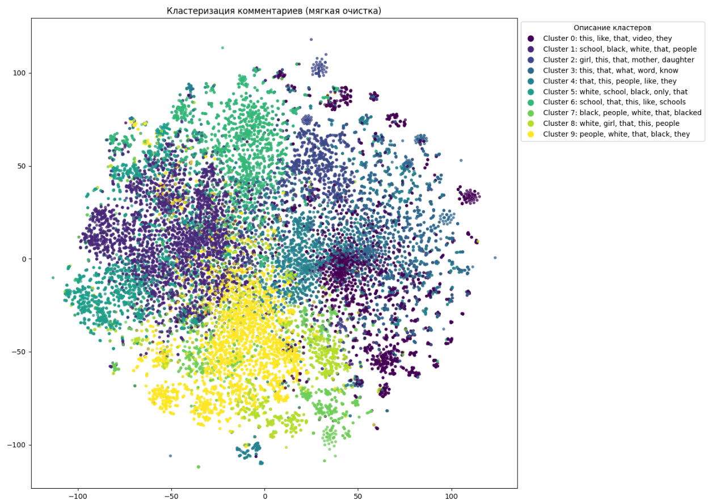
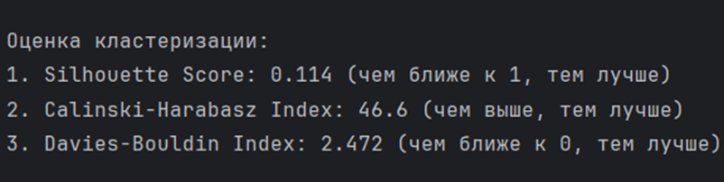
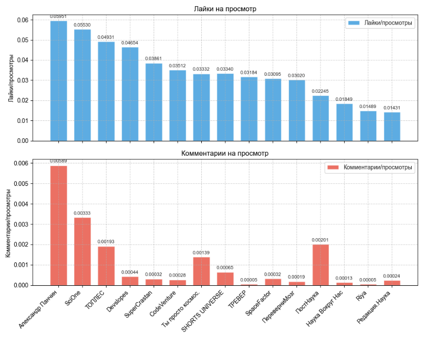

# 📊 youtube-insight-2025

> Анализ трендов на YouTube для бизнеса: находите популярные темы, создавайте востребованный контент и эффективно продвигайте продукцию или услуги.

---

## 🎯 Основные возможности

<details>
<summary>📈 Анализ трендов</summary>

- Инструменты мониторинга: YouTube Trends, Analytics 🔍
- Google Trends: сезонность, долгосрочные тренды 📅
- Сторонние сервисы: VidIQ, TubeBuddy, Social Blade 💡
</details>

<details>
<summary>🤝 Инфлюенсер-маркетинг</summary>

- Поиск и фильтрация каналов по ключевым словам и подписчикам 🎥
- Извлечение контактов: email, соцссылки 📧
- Сохранение данных в PostgreSQL, кеширование processed_ids.txt 🗄️
</details>

<details>
<summary>👍 YouTube Likes Tracker</summary>

Скрипт для периодического сбора числа лайков через API `returnyoutubedislikeapi.com`, сохранения истории в SQLite и уведомлений при превышении порога.

**Возможности:**
- Запрос текущего числа лайков по списку видео
- Сохранение истории в базе SQLite + логирование
- Оповещения при достижении порога

**Сфера применения:**
- уведомление автора при наборе определенного количества лайков, как следствие лучшее взаимодействие с аудиторией 

**Требования:**
- Python 3.7+
- Библиотеки: `requests`, `sqlite3`, `logging`
</details>

<details>
<summary>🔍 YouTube Scraper</summary>

Скрипт для поиска YouTube-каналов по запросам, фильтрации по подписчикам, извлечения контактной информации и сохранения в PostgreSQL.

**Основное:**
- Автопереключение API-ключей при превышении квоты
- Поиск каналов по ключевым словам и сортировка по просмотрам
- Фильтрация по минимуму подписчиков
- Извлечение email и соцссылок из описания
- Сохранение в таблицу `bloggers`, кеширование `processed_ids.txt`, логирование

**Требования:**
- Python ≥ 3.8
- Библиотеки: `google-api-python-client`, `python-dotenv`, `psycopg2-binary`
- Запущенный PostgreSQL
</details>

<details>
<summary>🛠 YouTube Shorts creator</summary>

- Загрузка видео: yt-dlp ⬇️
- Нарезка: MoviePy + FFmpeg ✂️
- Анализ аудио: Librosa + SpeechEmotionRecognition_Realtime 🎵
- Генерация шортсов/превью: Ollama 🤖

**Основная идея:**
- увеличение скорости нарезки видео на shorts для развития и набора подписчиков канала

**Проблемы:**
- скорость нарезки средняя
- при нарезки длинного видео может быть долгая обработка и нарезка 
- могут быть не найдены самые вирусные моменты
- риски теневого бана
</details>

<details>
<summary>💬 Анализ комментариев под видео</summary>

**Основная идея:**

Идея заключается в анализе комментариев под видео на YouTube с целью кластеризации их по темам, тонам и интересам. Это позволяет выделить ключевые темы, понять предпочтения аудитории и выявить улучшения для контента.

**Чем может быть полезно:**
- Понимание интересов аудитории: какие темы и форматы нравятся зрителям 🎯
- Улучшение контента: адаптация будущих видео под запросы аудитории 🎨
- Увеличение вовлеченности: релевантный контент повышает лайки и просмотры 📈
- Выявление проблем: устранение негативных моментов и критики ⚠️
- Идеи для новых видео: подсказки по темам и направлениям 💡

**Какой результат:**
- **Кластеризированные темы:** группы комментариев (похвалы, критика, запросы, вопросы)
- **Рекомендации:** конкретные шаги для улучшения ("больше видео про X", "улучшить звук")
- **Список запросов:** топ упоминаемых тем для новых роликов
- **Анализ тональности:** процент положительных, нейтральных и отрицательных комментариев 😊😐😞

  


**Качество кластеризации довольно низкое. Названия кластеров неинформативны.**




</details>

<details>
<summary>📊 Анализ видео у конкурентов</summary>

**Основная идея:**

Анализ видео других блогеров по заданной теме: просмотры, лайки, комментарии и другие метрики. Помогает выявить успешные форматы и подходы, а также избегать ошибок.

**Чем может быть полезно:**
- Понимание трендов: какие аспекты темы популярны у аудитории 🔥
- Оценка конкуренции: кто уже в нише и как показали себя их видео 🏅
- Идеи для улучшения: форматы, длина, стиль подачи, графика 🎥
- Избежание ошибок: учёт неудачных примеров ❌
- Оптимизация стратегии: незанятые подниши и новые подходы 🚀

**Какой результат:**
- **Список блогеров:** авторы по теме, подписчики, каналы
- **Анализ метрик:** таблицы/графики с просмотрами, лайками, комментариями
- **Рейтинг успешности:** вовлечённость (лайки+комментарии)/просмотры 🏆
- **Выводы по форматам:** обзор лучших типов контента (обзоры, инструкции и т.д.)
- **Рекомендации:** советы по созданию на основе успешных и неудачных примеров


  

**Полезные ссылки:**

На данном сайте можно посмотреть, как изменялось количество подписчиков на канале: https://socialblade.com/youtube
</details>

<details>
<summary>🔧 Техническая часть</summary>

<details>
<summary>comments_clustering.py</summary>

**Функционал:** очистка текста, лемматизация, векторизация SentenceTransformer, K-Means + t-SNE, анализ центров кластеров.

**Результат:** диаграмма кластеров, топ‑3 комментария к каждому, метрики Silhouette, Calinski‑Harabasz, Davies‑Bouldin.
</details>

<details>
<summary>comments_summary.py</summary>

Использует Ollama (модель Llama3) для суммаризации списка комментариев.
</details>

<details>
<summary>diagrams_connected_with_comments.py</summary>

- Столбчатая диаграмма средней длины комментариев по каналам
- График зависимости числа комментариев от длины комментария
- График зависимости числа комментариев от длительности видео
</details>

<details>
<summary>engagement.py</summary>

- Сортировка каналов по вовлечённости (лайки+комментарии)/просмотры
- Отдельные графики: лайки и комментарии в разных категориях
</details>

<details>
<summary>clustering.py</summary>

Аналогично comments_clustering, для других типов данных.
</details>

<details>
<summary>correlation.py</summary>

Сбор метаданных через VideoRepository, создание DataFrame, матрица корреляций и тепловая карта.
</details>

<details>
<summary>diagrams.py</summary>

- Точечный и линейный графики зависимости длительности видео от просмотров.
</details>

<details>
<summary>parsing_find_channel_id.py</summary>

Парсинг HTML, поиск Channel ID, сохранение новых каналов в БД.
</details>

<details>
<summary>update_video_channel_id.py</summary>

Установка поля channel_id: перебор каналов и их видео, обновление записей, где channel_id пуст.
</details>

<details>
<summary>update_new_columns.py</summary>

- get_channel_stats(): статистика канала через API YouTube
- print_channel_info(): обновление данных каналов в БД
</details>

<details>
<summary>search_for_similar_videos.py</summary>

Косинусная схожесть эмбеддингов, фильтрация по лайкам, топ‑3 похожих видео с метриками вовлечённости.
</details>

<details>
<summary>helper.py</summary>

- get_video_info_by_category(): статистика по категориям (просмотры, лайки, комментарии)
- get_video_info_by_channel(): агрегирует по каналам (фильтрация по category_id)
- get_video_info_by_manual_category(): анализ по пользовательским тематикам
</details>

</details>

---

## 🚀 Установка и запуск

```bash
# Клонировать репозиторий
git clone https://github.com/your-org/youtube-insight-2025.git
cd youtube-insight-2025

# Установить зависимости
pip install -r requirements.txt
````

---

## 📚 Использование

```bash
# Анализ трендов и генерация отчётов
python search_for_similar_videos.py
python diagrams.py
python correlation.py
python clustering.py
python comments_clustering.py


# Обработка видео и создание шортсов
python video_processor.py https://www.youtube.com/watch?v=VIDEO_ID
```

---

## 🔗 Контакты и обратная связь
* 💬 Telegram:
*  - Артур (@Mariavbgh) - Backend-разработка, аналитика данных, интеграции API 
   - Алиса (@alice6_6) - Анализ данных, интеграция API, кластеризация данных
   - Пётр Андреев (@PyotrAndreev) - Ментор, наставник
  

---

*Спасибо за использование youtube-insight-2025!* 🙏
